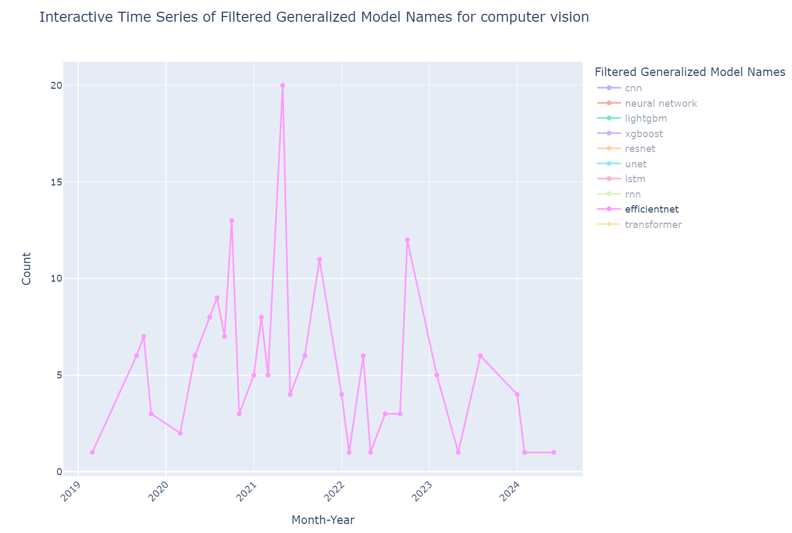

# Bridging the Gap Between Research and Practice: An Analysis of Machine Learning and Deep Learning Model Adoption on Kaggle

For my master’s thesis at Ludwig Maximilian University Munich, I conducted a comprehensive analysis of Kaggle competition data to investigate the alignment between machine learning and deep learning models proposed in academic research and those adopted in practice. The project involved developing a sophisticated data collection pipeline using Selenium and the Tor Browser to extract winning solutions and competition metadata while bypassing web security measures. I applied natural language processing techniques, including transformer-based models, to identify and standardize model names in the extracted data. Additionally, I designed and implemented data visualization and comparative analysis to uncover trends and insights into the adoption of machine learning and deep learning models in real-world scenarios.

Below are example visualizations:

